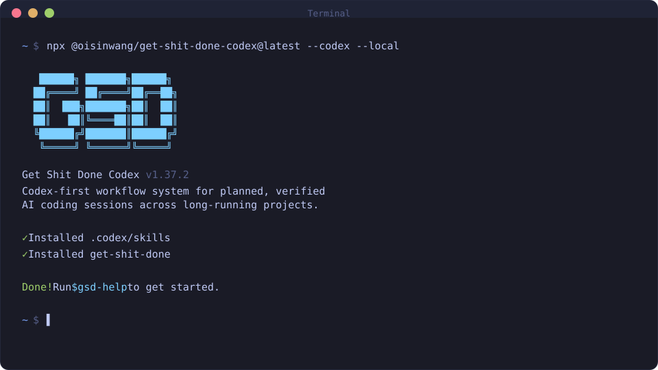

<div align="center">

# GET SHIT DONE CODEX

**English** | [Portuguese](README.pt-BR.md) | [Simplified Chinese](README.zh-CN.md) | [Japanese](README.ja-JP.md) | [Korean](README.ko-KR.md)

**A Codex-first workflow system for turning goals into planned, verified implementation across long-running AI coding sessions.**

**Keeps context, decisions, phase plans, validation checks, and recovery state explicit instead of hoping the model remembers everything.**

[](https://www.npmjs.com/package/@oisinwang/get-shit-done-codex)
[](https://www.npmjs.com/package/@oisinwang/get-shit-done-codex)
[](https://github.com/Oisinwang/get-shit-done-codex/actions/workflows/test.yml)
[](https://github.com/Oisinwang/get-shit-done-codex/stargazers)
[](LICENSE)

<br>

```bash
npx @oisinwang/get-shit-done-codex@latest
```

**Works on Mac, Windows, and Linux.**

<br>



<br>

*"If you know clearly what you want, this helps Codex keep building until the result is verifiable."*

*"Spec, plan, execute, review, and resume without importing a whole enterprise process."*

*"Codex is the primary runtime, with compatibility shims for other agent CLIs."*

<br>

**Published on npm as `@oisinwang/get-shit-done-codex`. Tested release branch: `codex/bootstrap`.**

**Independent Codex-first fork of GSD.** Use this fork when you want `AGENTS.md`, `.codex/`, `$gsd-*`, and Codex session paths to be the public default instead of migration details.

**Security and release hygiene:** scoped npm package, repository metadata, CI, release workflows, issue templates, and [community standards](CODE_OF_CONDUCT.md) all point at this fork. Legacy Claude-era names remain only as compatibility shims.

[Why This Fork Exists](#why-this-fork-exists) | [Examples](docs/EXAMPLES.md) | [FAQ](docs/FAQ.md) | [Comparison](docs/COMPARISON.md) | [Roadmap](docs/ROADMAP.md) | [How It Works](#how-it-works) | [Commands](#commands) | [Why It Works](#why-it-works) | [User Guide](docs/USER-GUIDE.md) | [Support](SUPPORT.md) | [Code of Conduct](CODE_OF_CONDUCT.md)

</div>

---

> [!IMPORTANT]
> This repository is an independent Codex-first fork.
>
> Primary semantics in this fork:
> - `AGENTS.md`
> - `.codex/`
> - `$gsd-*`
> - `agents_md_path`
> - `generate-agents-md`
> - `generate-agents-profile`
> - `~/.codex/sessions`
>
> Legacy Claude-first names remain only as compatibility shims. Migration and release notes live in [docs/CODEX-FORK.md](docs/CODEX-FORK.md).

---

## 60-Second Workflow

```bash
npx @oisinwang/get-shit-done-codex@latest
$gsd-new-project
$gsd-next
```

After the first pass, GSD leaves reviewable project memory instead of a loose chat transcript:

| Artifact | Why it matters |
|----------|----------------|
| `PROJECT.md` | Captures the goal, constraints, and project shape |
| `ROADMAP.md` | Turns the goal into phases the agent can execute and resume |
| `STATE.md` | Records current progress so later sessions know what happened |
| phase artifacts | Preserve discussion, plans, verification, and UAT evidence |

---

## Why This Fork Exists

This fork turns GSD into a Codex-first workflow. The canonical project contract is `AGENTS.md`, `.codex/`, and `$gsd-*` commands. Legacy Claude-first names remain only so existing projects can migrate without losing context.

The goal is simple: keep AI-assisted development coherent after the first prompt. GSD captures the goal, maps the codebase, plans implementation phases, executes with verification checkpoints, records decisions, and leaves enough state for Codex to resume work later.

It is for solo builders and small teams who want serious planning and validation without adopting enterprise process theater. You describe the outcome; the system preserves the requirements, checks the work, and makes the next action obvious.

---

## Who This Is For

People who want to describe what they want and have it built correctly without pretending they are running a 50-person engineering org.

Built-in quality gates catch real problems: schema drift detection flags ORM changes missing migrations, security enforcement anchors verification to threat models, and scope reduction detection prevents the planner from silently dropping your requirements.

## At a Glance

| If Codex work gets stuck because... | GSD gives you... |
|-------------------------------------|------------------|
| The model loses the original goal during a long session | `PROJECT.md`, `ROADMAP.md`, `STATE.md`, and phase artifacts that survive context resets |
| Plans quietly drop requirements | discussion logs, plan checks, and verification artifacts tied back to the requested outcome |
| Parallel agents leave messy changes | small phase plans, wave-based execution, and atomic commits that are easier to review or roll back |
| You need to stop and resume later | `$gsd-pause-work`, `$gsd-resume-work`, threads, todos, and handoff state |

### Current Highlights

- **Codex-first project contract** - `AGENTS.md`, `.codex/`, `$gsd-*`, and Codex session paths are the primary semantics.
- **Spiking and sketching** - `$gsd-spike` and `$gsd-sketch` capture experiments and design variants as durable planning artifacts.
- **Agent size-budget enforcement** - tiered line-count limits keep agent prompts lean and CI-visible.
- **Shared boilerplate extraction** - common reading and project-skill discovery logic is centralized instead of duplicated across agents.

---

## Pick a Workflow

| You want to... | Run this first | What GSD leaves behind |
|----------------|----------------|------------------------|
| Start from a rough idea | `$gsd-new-project --auto` | `PROJECT.md`, `ROADMAP.md`, and next-step state |
| Understand an existing repo before planning | `$gsd-map-codebase` | Codebase intelligence the planner can reuse |
| Make a small fix with guardrails | `$gsd-fast "fix the failing install check"` | A focused change with verification notes |
| Continue work after a break | `$gsd-resume-work` | Restored phase context and pending blockers |
| Compare a technical approach first | `$gsd-spike "validate the risky integration"` | Time-boxed experiment findings |
| Explore UI direction first | `$gsd-sketch "compare dashboard layouts"` | Throwaway mockups and selected design notes |

More copy-pastable playbooks live in [Examples](docs/EXAMPLES.md).

---

## Getting Started

```bash
npx @oisinwang/get-shit-done-codex@latest
```

For source-based development installs, use:

```bash
npm install
npm run build:hooks
node bin/install.js --codex --local
```

The installer prompts you to choose:
1. **Runtime** - Codex, Claude Code, OpenCode, Gemini, Kilo, Copilot, Cursor, Windsurf, Antigravity, Augment, Trae, Qwen Code, CodeBuddy, Cline, or all (interactive multi-select - pick multiple runtimes in a single install session)
2. **Location** - Global (all projects) or local (current project only)

Verify with:
- Codex: `$gsd-help`
- Claude Code / Gemini / Copilot / Antigravity / Qwen Code: `/gsd-help`
- OpenCode / Kilo / Augment / Trae / CodeBuddy: `/gsd-help`
- Cline: GSD installs via `.clinerules` - verify by checking `.clinerules` exists

> [!NOTE]
> Codex is the primary runtime in this fork. Managed installs write skills to `./.codex/skills/` or `~/.codex/skills/` and generate `AGENTS.md` by default. Legacy Claude compatibility still understands `.claude/skills/`, `~/.claude/skills/`, and `~/.claude/commands/gsd/` when present, but those paths are no longer the primary contract.
> Read `AGENTS.md` first for project instructions. `CLAUDE.md` only remains as a migration alias.

The canonical discovery contract is documented in [docs/skills/discovery-contract.md](docs/skills/discovery-contract.md).

> [!TIP]
> For source-based installs or environments where npm is unavailable, see **[docs/manual-update.md](docs/manual-update.md)**.

### Staying Updated

To update a source checkout after pulling this fork:

```bash
git pull
npm install
npm run build:hooks
node bin/install.js --codex --global
```
<details>
<summary><strong>Non-interactive Install (Docker, CI, Scripts)</strong></summary>

Codex entries below are the primary install path for this fork. Compatibility runtime examples follow.

```bash
# Codex
npx @oisinwang/get-shit-done-codex --codex --global    # Install to ~/.codex/
npx @oisinwang/get-shit-done-codex --codex --local     # Install to ./.codex/

# Claude Code compatibility/runtime
npx @oisinwang/get-shit-done-codex --claude --global   # Install to ~/.claude/
npx @oisinwang/get-shit-done-codex --claude --local    # Install to ./.claude/

# OpenCode
npx @oisinwang/get-shit-done-codex --opencode --global # Install to ~/.config/opencode/

# Gemini CLI
npx @oisinwang/get-shit-done-codex --gemini --global   # Install to ~/.gemini/

# Kilo
npx @oisinwang/get-shit-done-codex --kilo --global     # Install to ~/.config/kilo/
npx @oisinwang/get-shit-done-codex --kilo --local      # Install to ./.kilo/

# Copilot
npx @oisinwang/get-shit-done-codex --copilot --global  # Install to ~/.github/
npx @oisinwang/get-shit-done-codex --copilot --local   # Install to ./.github/

# Cursor CLI
npx @oisinwang/get-shit-done-codex --cursor --global      # Install to ~/.cursor/
npx @oisinwang/get-shit-done-codex --cursor --local       # Install to ./.cursor/

# Windsurf
npx @oisinwang/get-shit-done-codex --windsurf --global    # Install to ~/.codeium/windsurf/
npx @oisinwang/get-shit-done-codex --windsurf --local     # Install to ./.windsurf/

# Antigravity
npx @oisinwang/get-shit-done-codex --antigravity --global # Install to ~/.gemini/antigravity/
npx @oisinwang/get-shit-done-codex --antigravity --local  # Install to ./.agent/

# Augment
npx @oisinwang/get-shit-done-codex --augment --global     # Install to ~/.augment/
npx @oisinwang/get-shit-done-codex --augment --local      # Install to ./.augment/

# Trae
npx @oisinwang/get-shit-done-codex --trae --global        # Install to ~/.trae/
npx @oisinwang/get-shit-done-codex --trae --local         # Install to ./.trae/

# Qwen Code
npx @oisinwang/get-shit-done-codex --qwen --global        # Install to ~/.qwen/
npx @oisinwang/get-shit-done-codex --qwen --local         # Install to ./.qwen/

# CodeBuddy
npx @oisinwang/get-shit-done-codex --codebuddy --global   # Install to ~/.codebuddy/
npx @oisinwang/get-shit-done-codex --codebuddy --local    # Install to ./.codebuddy/

# Cline
npx @oisinwang/get-shit-done-codex --cline --global       # Install to ~/.cline/
npx @oisinwang/get-shit-done-codex --cline --local        # Install to ./.clinerules

# All runtimes
npx @oisinwang/get-shit-done-codex --all --global      # Install to all directories
```

Use `--global` (`-g`) or `--local` (`-l`) to skip the location prompt.
Use `--codex`, `--claude`, `--opencode`, `--gemini`, `--kilo`, `--copilot`, `--cursor`, `--windsurf`, `--antigravity`, `--augment`, `--trae`, `--qwen`, `--codebuddy`, `--cline`, or `--all` to skip the runtime prompt.
The GSD SDK CLI (`gsd-sdk`) is installed automatically (required by `$gsd-*` commands). Pass `--no-sdk` to skip the SDK install, or `--sdk` to force a reinstall.

</details>

<details>
<summary><strong>Development Installation</strong></summary>

Clone the repository, build hooks, and run the installer locally:

```bash
git clone https://github.com/Oisinwang/get-shit-done-codex.git
cd get-shit-done-codex
npm run build:hooks
node bin/install.js --codex --local
```

The `build:hooks` step is required - it compiles hook sources into `hooks/dist/` which the installer copies from. Without it, hooks won't be installed and you'll get hook errors in Claude Code. (The npm release handles this automatically via `prepublishOnly`.)

Installs to `./.codex/` for testing modifications before contributing.

</details>

### Recommended: Skip Permissions Mode

GSD is designed for frictionless automation. If you are using Claude Code, run it with:

```bash
claude --dangerously-skip-permissions
```

> [!TIP]
> This is how GSD is intended to be used - stopping to approve `date` and `git commit` 50 times defeats the purpose.

<details>
<summary><strong>Alternative: Granular Permissions</strong></summary>

If you prefer not to use that flag, Claude Code compatibility/runtime users can add this to their project's `.claude/settings.json`:

```json
{
  "permissions": {
    "allow": [
      "Bash(date:*)",
      "Bash(echo:*)",
      "Bash(cat:*)",
      "Bash(ls:*)",
      "Bash(mkdir:*)",
      "Bash(wc:*)",
      "Bash(head:*)",
      "Bash(tail:*)",
      "Bash(sort:*)",
      "Bash(grep:*)",
      "Bash(tr:*)",
      "Bash(git add:*)",
      "Bash(git commit:*)",
      "Bash(git status:*)",
      "Bash(git log:*)",
      "Bash(git diff:*)",
      "Bash(git tag:*)"
    ]
  }
}
```

</details>

---

## How It Works

> **Already have code?** Run `$gsd-map-codebase` first. It spawns parallel agents to analyze your stack, architecture, conventions, and concerns. Then `$gsd-new-project` knows your codebase - questions focus on what you're adding, and planning automatically loads your patterns.

### 1. Initialize Project

```
$gsd-new-project
```

One command, one flow. The system:

1. **Questions** - Asks until it understands your idea completely (goals, constraints, tech preferences, edge cases)
2. **Research** - Spawns parallel agents to investigate the domain (optional but recommended)
3. **Requirements** - Extracts what's v1, v2, and out of scope
4. **Roadmap** - Creates phases mapped to requirements

You approve the roadmap. Now you're ready to build.

**Creates:** `PROJECT.md`, `REQUIREMENTS.md`, `ROADMAP.md`, `STATE.md`, `.planning/research/`

---

### 2. Discuss Phase

```
$gsd-discuss-phase 1
```

**This is where you shape the implementation.**

Your roadmap has a sentence or two per phase. That's not enough context to build something the way *you* imagine it. This step captures your preferences before anything gets researched or planned.

The system analyzes the phase and identifies gray areas based on what's being built:

- **Visual features** -> Layout, density, interactions, empty states
- **APIs/CLIs** -> Response format, flags, error handling, verbosity
- **Content systems** -> Structure, tone, depth, flow
- **Organization tasks** -> Grouping criteria, naming, duplicates, exceptions

For each area you select, it asks until you're satisfied. The output - `CONTEXT.md` - feeds directly into the next two steps:

1. **Researcher reads it** - Knows what patterns to investigate ("user wants card layout" -> research card component libraries)
2. **Planner reads it** - Knows what decisions are locked ("infinite scroll decided" -> plan includes scroll handling)

The deeper you go here, the more the system builds what you actually want. Skip it and you get reasonable defaults. Use it and you get *your* vision.

**Creates:** `{phase_num}-CONTEXT.md`

> **Assumptions Mode:** Prefer codebase analysis over questions? Set `workflow.discuss_mode` to `assumptions` in `$gsd-settings`. The system reads your code, surfaces what it would do and why, and only asks you to correct what's wrong. See [Discuss Mode](docs/workflow-discuss-mode.md).

---

### 3. Plan Phase

```
$gsd-plan-phase 1
```

The system:

1. **Researches** - Investigates how to implement this phase, guided by your CONTEXT.md decisions
2. **Plans** - Creates 2-3 atomic task plans with XML structure
3. **Verifies** - Checks plans against requirements, loops until they pass

Each plan is small enough to execute in a fresh context window. No degradation, no "I'll be more concise now."

**Creates:** `{phase_num}-RESEARCH.md`, `{phase_num}-{N}-PLAN.md`

---

### 4. Execute Phase

```
$gsd-execute-phase 1
```

The system:

1. **Runs plans in waves** - Parallel where possible, sequential when dependent
2. **Fresh context per plan** - 200k tokens purely for implementation, zero accumulated garbage
3. **Commits per task** - Every task gets its own atomic commit
4. **Verifies against goals** - Checks the codebase delivers what the phase promised

Walk away, come back to completed work with clean git history.

**How Wave Execution Works:**

Plans are grouped into "waves" based on dependencies. Within each wave, plans run in parallel. Waves run sequentially.

```
PHASE EXECUTION

Wave 1 (parallel)        Wave 2 (parallel)        Wave 3
+-----------+            +-----------+            +-----------+
| Plan 01   |            | Plan 03   |            | Plan 05   |
| User      | ----+      | Orders    | ----+      | Checkout  |
| Model     |     |      | API       |     |      | UI        |
+-----------+     |      +-----------+     |      +-----------+
                  |                        |
+-----------+     |      +-----------+     |
| Plan 02   | ----+----> | Plan 04   | ----+
| Product   |            | Cart      |
| Model     |            | API       |
+-----------+            +-----------+

Dependencies: Plan 03 needs Plan 01
              Plan 04 needs Plan 02
              Plan 05 needs Plans 03 + 04
```

**Why waves matter:**
- Independent plans -> Same wave -> Run in parallel
- Dependent plans -> Later wave -> Wait for dependencies
- File conflicts -> Sequential plans or same plan

This is why "vertical slices" (Plan 01: User feature end-to-end) parallelize better than "horizontal layers" (Plan 01: All models, Plan 02: All APIs).

**Creates:** `{phase_num}-{N}-SUMMARY.md`, `{phase_num}-VERIFICATION.md`

---

### 5. Verify Work

```
$gsd-verify-work 1
```

**This is where you confirm it actually works.**

Automated verification checks that code exists and tests pass. But does the feature *work* the way you expected? This is your chance to use it.

The system:

1. **Extracts testable deliverables** - What you should be able to do now
2. **Walks you through one at a time** -"Can you log in with email?" Yes/no, or describe what's wrong
3. **Diagnoses failures automatically** - Spawns debug agents to find root causes
4. **Creates verified fix plans** - Ready for immediate re-execution

If everything passes, you move on. If something's broken, you don't manually debug - you just run `$gsd-execute-phase` again with the fix plans it created.

**Creates:** `{phase_num}-UAT.md`, fix plans if issues found

---

### 6. Repeat -> Ship -> Complete -> Next Milestone

```
$gsd-discuss-phase 2
$gsd-plan-phase 2
$gsd-execute-phase 2
$gsd-verify-work 2
$gsd-ship 2                  # Create PR from verified work
...
$gsd-complete-milestone
$gsd-new-milestone
```

Or let GSD figure out the next step automatically:

```
$gsd-next                    # Auto-detect and run next step
```

Loop **discuss -> plan -> execute -> verify -> ship** until milestone complete.

If you want faster intake during discussion, use `$gsd-discuss-phase <n> --batch` to answer a small grouped set of questions at once instead of one-by-one. Use `--chain` to auto-chain discuss into plan+execute without stopping between steps.

Each phase gets your input (discuss), proper research (plan), clean execution (execute), and human verification (verify). Context stays fresh. Quality stays high.

When all phases are done, `$gsd-complete-milestone` archives the milestone and tags the release.

Then `$gsd-new-milestone` starts the next version - same flow as `new-project` but for your existing codebase. You describe what you want to build next, the system researches the domain, you scope requirements, and it creates a fresh roadmap. Each milestone is a clean cycle: define -> build -> ship.

---

### Quick Mode

```
$gsd-quick
```

**For ad-hoc tasks that don't need full planning.**

Quick mode gives you GSD guarantees (atomic commits, state tracking) with a faster path:

- **Same agents** - Planner + executor, same quality
- **Skips optional steps** - No research, no plan checker, no verifier by default
- **Separate tracking** - Lives in `.planning/quick/`, not phases

**`--discuss` flag:** Lightweight discussion to surface gray areas before planning.

**`--research` flag:** Spawns a focused researcher before planning. Investigates implementation approaches, library options, and pitfalls. Use when you're unsure how to approach a task.

**`--full` flag:** Enables all phases - discussion + research + plan-checking + verification. The full GSD pipeline in quick-task form.

**`--validate` flag:** Enables plan-checking + post-execution verification only (the previous `--full` behavior).

Flags are composable: `--discuss --research --validate` gives discussion + research + plan-checking + verification.

```
$gsd-quick
> What do you want to do? "Add dark mode toggle to settings"
```

**Creates:** `.planning/quick/001-add-dark-mode-toggle/PLAN.md`, `SUMMARY.md`

---

## Why It Works

### Context Engineering

Codex is powerful when it has durable project context. Most long-running coding sessions lose that context unless it is made explicit.

GSD handles it for you:

| File | What it does |
|------|--------------|
| `PROJECT.md` | Project vision, always loaded |
| `research/` | Ecosystem knowledge (stack, features, architecture, pitfalls) |
| `REQUIREMENTS.md` | Scoped v1/v2 requirements with phase traceability |
| `ROADMAP.md` | Where you're going, what's done |
| `STATE.md` | Decisions, blockers, position - memory across sessions |
| `PLAN.md` | Atomic task with XML structure, verification steps |
| `SUMMARY.md` | What happened, what changed, committed to history |
| `todos/` | Captured ideas and tasks for later work |
| `threads/` | Persistent context threads for cross-session work |
| `seeds/` | Forward-looking ideas that surface at the right milestone |

Size limits are based on where long-context coding quality starts to degrade. Stay under them and the workflow stays predictable.

### XML Prompt Formatting

Every plan is structured XML optimized for agent readability and execution:

```xml
<task type="auto">
  <name>Create login endpoint</name>
  <files>src/app/api/auth/login/route.ts</files>
  <action>
    Use jose for JWT (not jsonwebtoken - CommonJS issues).
    Validate credentials against users table.
    Return httpOnly cookie on success.
  </action>
  <verify>curl - X POST localhost:3000/api/auth/login returns 200 + Set-Cookie</verify>
  <done>Valid credentials return cookie, invalid return 401</done>
</task>
```

Precise instructions. No guessing. Verification built in.

### Multi-Agent Orchestration

Every stage uses the same pattern: a thin orchestrator spawns specialized agents, collects results, and routes to the next step.

| Stage | Orchestrator does | Agents do |
|-------|------------------|-----------|
| Research | Coordinates, presents findings | 4 parallel researchers investigate stack, features, architecture, pitfalls |
| Planning | Validates, manages iteration | Planner creates plans, checker verifies, loop until pass |
| Execution | Groups into waves, tracks progress | Executors implement in parallel, each with fresh 200k context |
| Verification | Presents results, routes next | Verifier checks codebase against goals, debuggers diagnose failures |

The orchestrator never does heavy lifting. It spawns agents, waits, integrates results.

**The result:** You can run an entire phase - deep research, multiple plans created and verified, thousands of lines of code written across parallel executors, automated verification against goals - and your main context window stays at 30-40%. The work happens in fresh subagent contexts. Your session stays fast and responsive.

### Atomic Git Commits

Each task gets its own commit immediately after completion:

```bash
abc123f docs(08-02): complete user registration plan
def456g feat(08-02): add email confirmation flow
hij789k feat(08-02): implement password hashing
lmn012o feat(08-02): create registration endpoint
```

> [!NOTE]
> **Benefits:** Git bisect finds exact failing task. Each task independently revertable. Clear history for Claude in future sessions. Better observability in AI-automated workflow.

Every commit is surgical, traceable, and meaningful.

### Modular by Design

- Add phases to current milestone
- Insert urgent work between phases
- Complete milestones and start fresh
- Adjust plans without rebuilding everything

You're never locked in. The system adapts.

---

## Commands

### Core Workflow

| Command | What it does |
|---------|--------------|
| `$gsd-new-project [--auto]` | Full initialization: questions -> research -> requirements -> roadmap |
| `$gsd-discuss-phase [N] [--auto] [--analyze] [--chain]` | Capture implementation decisions before planning (`--analyze` adds trade-off analysis, `--chain` auto-chains into plan+execute) |
| `$gsd-plan-phase [N] [--auto] [--reviews]` | Research + plan + verify for a phase (`--reviews` loads codebase review findings) |
| `$gsd-execute-phase <N>` | Execute all plans in parallel waves, verify when complete |
| `$gsd-verify-work [N]` | Manual user acceptance testing * |
| `$gsd-ship [N] [--draft]` | Create PR from verified phase work with auto-generated body |
| `$gsd-next` | Automatically advance to the next logical workflow step |
| `$gsd-fast <text>` | Inline trivial tasks - skips planning entirely, executes immediately |
| `$gsd-audit-milestone` | Verify milestone achieved its definition of done |
| `$gsd-complete-milestone` | Archive milestone, tag release |
| `$gsd-new-milestone [name]` | Start next version: questions -> research -> requirements -> roadmap |
| `$gsd-forensics [desc]` | Post-mortem investigation of failed workflow runs (diagnoses stuck loops, missing artifacts, git anomalies) |
| `$gsd-milestone-summary [version]` | Generate comprehensive project summary for team onboarding and review |

### Workstreams

| Command | What it does |
|---------|--------------|
| `$gsd-workstreams list` | Show all workstreams and their status |
| `$gsd-workstreams create <name>` | Create a namespaced workstream for parallel milestone work |
| `$gsd-workstreams switch <name>` | Switch active workstream |
| `$gsd-workstreams complete <name>` | Complete and merge a workstream |

### Multi-Project Workspaces

| Command | What it does |
|---------|--------------|
| `$gsd-new-workspace` | Create isolated workspace with repo copies (worktrees or clones) |
| `$gsd-list-workspaces` | Show all GSD workspaces and their status |
| `$gsd-remove-workspace` | Remove workspace and clean up worktrees |

### Spiking & Sketching

| Command | What it does |
|---------|--------------|
| `$gsd-spike [idea] [--quick]` | Throwaway experiments to validate feasibility before planning - no project init required |
| `$gsd-sketch [idea] [--quick]` | Throwaway HTML mockups with multi-variant exploration - no project init required |
| `$gsd-spike-wrap-up` | Package spike findings into a project-local skill for future build conversations |
| `$gsd-sketch-wrap-up` | Package sketch design findings into a project-local skill for future builds |

### UI Design

| Command | What it does |
|---------|--------------|
| `$gsd-ui-phase [N]` | Generate UI design contract (UI-SPEC.md) for frontend phases |
| `$gsd-ui-review [N]` | Retroactive 6-pillar visual audit of implemented frontend code |

### Navigation

| Command | What it does |
|---------|--------------|
| `$gsd-progress` | Where am I? What's next? |
| `$gsd-next` | Auto-detect state and run the next step |
| `$gsd-help` | Show all commands and usage guide |
| `$gsd-update` | Update GSD with changelog preview |
| `$gsd-join-discord` | Open GitHub Discussions community |
| `$gsd-manager` | Interactive command center for managing multiple phases |

### Brownfield

| Command | What it does |
|---------|--------------|
| `$gsd-map-codebase [area]` | Analyze existing codebase before new-project |

### Phase Management

| Command | What it does |
|---------|--------------|
| `$gsd-add-phase` | Append phase to roadmap |
| `$gsd-insert-phase [N]` | Insert urgent work between phases |
| `$gsd-remove-phase [N]` | Remove future phase, renumber |
| `$gsd-list-phase-assumptions [N]` | See the planned approach before planning |
| `$gsd-plan-milestone-gaps` | Create phases to close gaps from audit |

### Session

| Command | What it does |
|---------|--------------|
| `$gsd-pause-work` | Create handoff when stopping mid-phase (writes HANDOFF.json) |
| `$gsd-resume-work` | Restore from last session |
| `$gsd-session-report` | Generate session summary with work performed and outcomes |

### Workstreams

| Command | What it does |
|---------|--------------|
| `$gsd-workstreams` | Manage parallel workstreams (list, create, switch, status, progress, complete) |

### Code Quality

| Command | What it does |
|---------|--------------|
| `$gsd-review` | Cross-AI peer review of current phase or branch |
| `$gsd-secure-phase [N]` | Security enforcement with threat-model-anchored verification |
| `$gsd-pr-branch` | Create clean PR branch filtering `.planning/` commits |
| `$gsd-audit-uat` | Audit verification debt - find phases missing UAT |
| `$gsd-docs-update` | Verified documentation generation with doc-writer and doc-verifier agents |

### Backlog & Threads

| Command | What it does |
|---------|--------------|
| `$gsd-plant-seed <idea>` | Capture forward-looking ideas with trigger conditions - surfaces at the right milestone |
| `$gsd-add-backlog <desc>` | Add idea to backlog parking lot (999.x numbering, outside active sequence) |
| `$gsd-review-backlog` | Review and promote backlog items to active milestone or remove stale entries |
| `$gsd-thread [name]` | Persistent context threads - lightweight cross-session knowledge for work spanning multiple sessions |

### Utilities

| Command | What it does |
|---------|--------------|
| `$gsd-settings` | Configure model profile and workflow agents |
| `$gsd-set-profile <profile>` | Switch model profile (quality/balanced/budget/inherit) |
| `$gsd-add-todo [desc]` | Capture idea for later |
| `$gsd-check-todos` | List pending todos |
| `$gsd-debug [desc]` | Systematic debugging with persistent state |
| `$gsd-do <text>` | Route freeform text to the right GSD command automatically |
| `$gsd-note <text>` | Zero-friction idea capture - append, list, or promote notes to todos |
| `$gsd-quick [--full] [--validate] [--discuss] [--research]` | Execute ad-hoc task with GSD guarantees (`--full` enables all phases, `--validate` adds plan-checking and verification, `--discuss` gathers context first, `--research` investigates approaches before planning) |
| `$gsd-health [--repair]` | Validate `.planning/` directory integrity, auto-repair with `--repair` |
| `$gsd-stats` | Display project statistics - phases, plans, requirements, git metrics |
| `$gsd-profile-user [--questionnaire] [--refresh]` | Generate developer behavioral profile from session analysis for personalized responses |

<sup>* Contributed by reddit user OracleGreyBeard</sup>

---

## Configuration

GSD stores project settings in `.planning/config.json`. Configure during `$gsd-new-project` or update later with `$gsd-settings`. For the full config schema, workflow toggles, git branching options, and per-agent model breakdown, see the [User Guide](docs/USER-GUIDE.md#configuration-reference).

### Core Settings

| Setting | Options | Default | What it controls |
|---------|---------|---------|------------------|
| `mode` | `yolo`, `interactive` | `interactive` | Auto-approve vs confirm at each step |
| `granularity` | `coarse`, `standard`, `fine` | `standard` | Phase granularity - how finely scope is sliced (phases x plans) |
| `project_code` | string | `""` | Prefix phase directories with a project code |

### Model Profiles

Control which model profile each agent uses. Balance quality vs token spend.

| Profile | Planning | Execution | Verification |
|---------|----------|-----------|--------------|
| `quality` | Opus | Opus | Sonnet |
| `balanced` (default) | Opus | Sonnet | Sonnet |
| `budget` | Sonnet | Sonnet | Haiku |
| `inherit` | Inherit | Inherit | Inherit |

Switch profiles:
```
$gsd-set-profile budget
```

Use `inherit` when using non-Anthropic providers (OpenRouter, local models) or to follow the current runtime model selection (e.g. OpenCode `/model`).

Or configure via `$gsd-settings`.

### Workflow Agents

These spawn additional agents during planning/execution. They improve quality but add tokens and time.

| Setting | Default | What it does |
|---------|---------|--------------|
| `workflow.research` | `true` | Researches domain before planning each phase |
| `workflow.plan_check` | `true` | Verifies plans achieve phase goals before execution |
| `workflow.verifier` | `true` | Confirms must-haves were delivered after execution |
| `workflow.auto_advance` | `false` | Auto-chain discuss -> plan -> execute without stopping |
| `workflow.research_before_questions` | `false` | Run research before discussion questions instead of after |
| `workflow.discuss_mode` | `'discuss'` | Discussion mode: `discuss` (interview), `assumptions` (codebase-first) |
| `workflow.skip_discuss` | `false` | Skip discuss-phase in autonomous mode |
| `workflow.text_mode` | `false` | Text-only mode for remote sessions (no TUI menus) |
| `workflow.use_worktrees` | `true` | Toggle worktree isolation for execution |

Use `$gsd-settings` to toggle these, or override per-invocation:
- `$gsd-plan-phase --skip-research`
- `$gsd-plan-phase --skip-verify`

### Execution

| Setting | Default | What it controls |
|---------|---------|------------------|
| `parallelization.enabled` | `true` | Run independent plans simultaneously |
| `planning.commit_docs` | `true` | Track `.planning/` in git |
| `hooks.context_warnings` | `true` | Show context window usage warnings |

### Agent Skills

Inject project-specific skills into subagents during execution.

| Setting | Type | What it does |
|---------|------|--------------|
| `agent_skills.<agent_type>` | `string[]` | Paths to skill directories loaded into that agent type at spawn time |

Skills are injected as `<agent_skills>` blocks in agent prompts, giving subagents access to project-specific knowledge.

### Git Branching

Control how GSD handles branches during execution.

| Setting | Options | Default | What it does |
|---------|---------|---------|--------------|
| `git.branching_strategy` | `none`, `phase`, `milestone` | `none` | Branch creation strategy |
| `git.phase_branch_template` | string | `gsd/phase-{phase}-{slug}` | Template for phase branches |
| `git.milestone_branch_template` | string | `gsd/{milestone}-{slug}` | Template for milestone branches |

**Strategies:**
- **`none`** - Commits to current branch (default GSD behavior)
- **`phase`** - Creates a branch per phase, merges at phase completion
- **`milestone`** - Creates one branch for entire milestone, merges at completion

At milestone completion, GSD offers squash merge (recommended) or merge with history.

---

## Security

### Built-in Security Hardening

GSD includes defense-in-depth security since v1.27:

- **Path traversal prevention** - All user-supplied file paths (`--text-file`, `--prd`) are validated to resolve within the project directory
- **Prompt injection detection** - Centralized `security.cjs` module scans for injection patterns in user-supplied text before it enters planning artifacts
- **PreToolUse prompt guard hook** - `gsd-prompt-guard` scans writes to `.planning/` for embedded injection vectors (advisory, not blocking)
- **Safe JSON parsing** - Malformed `--fields` arguments are caught before they corrupt state
- **Shell argument validation** - User text is sanitized before shell interpolation
- **CI-ready injection scanner** - `prompt-injection-scan.test.cjs` scans all agent/workflow/command files for embedded injection vectors

> [!NOTE]
> Because GSD generates markdown files that become LLM system prompts, any user-controlled text flowing into planning artifacts is a potential indirect prompt injection vector. These protections are designed to catch such vectors at multiple layers.

### Protecting Sensitive Files

GSD's codebase mapping and analysis commands read files to understand your project. **Protect files containing secrets** by adding them to Claude Code compatibility/runtime deny lists:

1. Open Claude Code compatibility/runtime settings (`.claude/settings.json` or global)
2. Add sensitive file patterns to the deny list:

```json
{
  "permissions": {
    "deny": [
      "Read(.env)",
      "Read(.env.*)",
      "Read(**/secrets/*)",
      "Read(**/*credential*)",
      "Read(**/*.pem)",
      "Read(**/*.key)"
    ]
  }
}
```

This prevents Claude from reading these files entirely, regardless of what commands you run.

> [!IMPORTANT]
> GSD includes built-in protections against committing secrets, but defense-in-depth is best practice. Deny read access to sensitive files as a first line of defense.

---

## Support

Use [SUPPORT.md](SUPPORT.md) to choose the right public or private channel:

- Questions and usage help: GitHub Discussions
- Reproducible bugs: the issue chooser
- Feature and enhancement proposals: approved issue flow in `CONTRIBUTING.md`
- Security vulnerabilities: GitHub private vulnerability reporting

---

## Troubleshooting

**Commands not found after install?**
- Restart your runtime to reload commands/skills
- Verify files exist in `~/.codex/skills/gsd-*/SKILL.md` for managed global installs
- For local installs, verify `./.codex/skills/gsd-*/SKILL.md`
- If you are migrating from legacy Claude installs, also check `~/.claude/skills/gsd-*/SKILL.md` or `~/.claude/commands/gsd/`

**Commands not working as expected?**
- Run `$gsd-help` to verify installation in Codex
- Re-run `npx @oisinwang/get-shit-done-codex` or `node bin/install.js --codex --global` to reinstall

**Updating to the latest version?**
```bash
npx @oisinwang/get-shit-done-codex@latest
```

**Using Docker or containerized environments?**

If you are migrating a legacy Claude install in a container, keep the compatibility notes in [docs/CODEX-FORK.md](docs/CODEX-FORK.md) handy. The Codex-first install paths are still `./.codex/` and `~/.codex/`.

### Uninstalling

To remove GSD completely:

```bash
# Global installs
npx @oisinwang/get-shit-done-codex --claude --global --uninstall
npx @oisinwang/get-shit-done-codex --opencode --global --uninstall
npx @oisinwang/get-shit-done-codex --gemini --global --uninstall
npx @oisinwang/get-shit-done-codex --kilo --global --uninstall
npx @oisinwang/get-shit-done-codex --codex --global --uninstall
npx @oisinwang/get-shit-done-codex --copilot --global --uninstall
npx @oisinwang/get-shit-done-codex --cursor --global --uninstall
npx @oisinwang/get-shit-done-codex --windsurf --global --uninstall
npx @oisinwang/get-shit-done-codex --antigravity --global --uninstall
npx @oisinwang/get-shit-done-codex --augment --global --uninstall
npx @oisinwang/get-shit-done-codex --trae --global --uninstall
npx @oisinwang/get-shit-done-codex --qwen --global --uninstall
npx @oisinwang/get-shit-done-codex --codebuddy --global --uninstall
npx @oisinwang/get-shit-done-codex --cline --global --uninstall

# Local installs (current project)
npx @oisinwang/get-shit-done-codex --claude --local --uninstall
npx @oisinwang/get-shit-done-codex --opencode --local --uninstall
npx @oisinwang/get-shit-done-codex --gemini --local --uninstall
npx @oisinwang/get-shit-done-codex --kilo --local --uninstall
npx @oisinwang/get-shit-done-codex --codex --local --uninstall
npx @oisinwang/get-shit-done-codex --copilot --local --uninstall
npx @oisinwang/get-shit-done-codex --cursor --local --uninstall
npx @oisinwang/get-shit-done-codex --windsurf --local --uninstall
npx @oisinwang/get-shit-done-codex --antigravity --local --uninstall
npx @oisinwang/get-shit-done-codex --augment --local --uninstall
npx @oisinwang/get-shit-done-codex --trae --local --uninstall
npx @oisinwang/get-shit-done-codex --qwen --local --uninstall
npx @oisinwang/get-shit-done-codex --codebuddy --local --uninstall
npx @oisinwang/get-shit-done-codex --cline --local --uninstall
```

This removes all GSD commands, agents, hooks, and settings while preserving your other configurations.

---

## Multi-Runtime Lineage

Codex is the primary runtime in this fork. Compatibility installs are available via `npx @oisinwang/get-shit-done-codex` for Claude Code, OpenCode, Gemini CLI, Kilo, Copilot, Cursor, Windsurf, Antigravity, Augment, Trae, Qwen Code, CodeBuddy, and Cline.

These earlier community ports helped prove multi-runtime demand:

| Project | Platform | Description |
|---------|----------|-------------|
| [gsd-opencode](https://github.com/rokicool/gsd-opencode) | OpenCode | Original OpenCode adaptation |
| gsd-gemini (archived) | Gemini CLI | Original Gemini adaptation by uberfuzzy |

---

## Star History

<a href="https://star-history.com/#Oisinwang/get-shit-done-codex&Date">
 <picture>
   <source media="(prefers-color-scheme: dark)" srcset="https://api.star-history.com/svg?repos=Oisinwang/get-shit-done-codex&type=Date&theme=dark" />
   <source media="(prefers-color-scheme: light)" srcset="https://api.star-history.com/svg?repos=Oisinwang/get-shit-done-codex&type=Date" />
   
 </picture>
</a>

---

## License

MIT License. See [LICENSE](LICENSE) for details.

---

<div align="center">

**Codex is powerful. GSD makes long-running work verifiable.**

</div>
